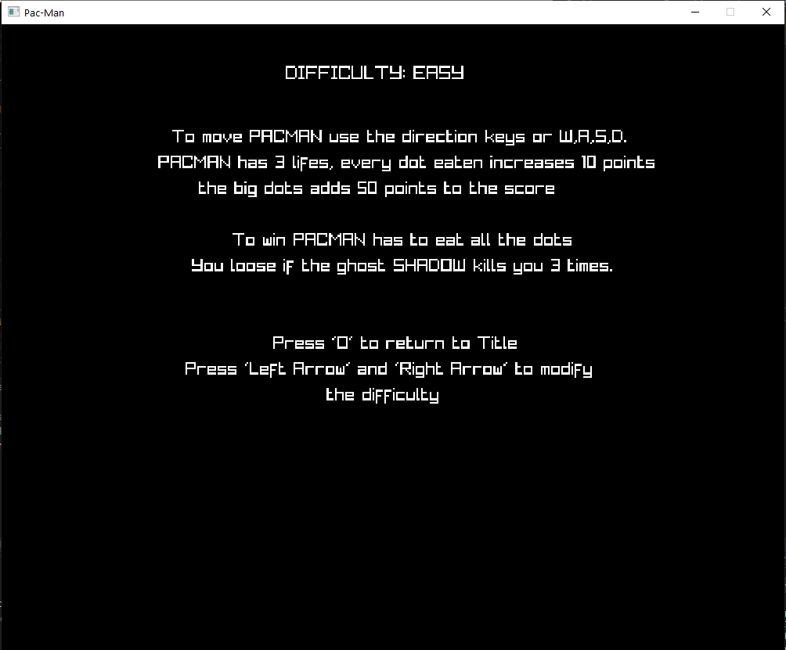

 
	  .         .                                                  
	 8 888888888o      .8.           ,o888888o.                       ,8.       ,8.                   .8.          b.             8 
	 8 8888    `88.   .888.         8888     `88.                    ,888.     ,888.                 .888.         888o.          8 
	 8 8888     `88  :88888.     ,8 8888       `8.                  .`8888.   .`8888.               :88888.        Y88888o.       8 
	 8 8888     ,88 . `88888.    88 8888                           ,8.`8888. ,8.`8888.             . `88888.       .`Y888888o.    8 
	 8 8888.   ,88'.8. `88888.   88 8888                          ,8'8.`8888,8^8.`8888.           .8. `88888.      8o. `Y888888o. 8 
	 8 888888888P'.8`8. `88888.  88 8888                         ,8' `8.`8888' `8.`8888.         .8`8. `88888.     8`Y8o. `Y88888o8 
	 8 8888      .8' `8. `88888. 88 8888                        ,8'   `8.`88'   `8.`8888.       .8' `8. `88888.    8   `Y8o. `Y8888 
	 8 8888     .8'   `8. `88888.`8 8888       .8'             ,8'     `8.`'     `8.`8888.     .8'   `8. `88888.   8      `Y8o. `Y8 
	 8 8888    .888888888. `88888.  8888     ,88'             ,8'       `8        `8.`8888.   .888888888. `88888.  8         `Y8o.` 
	 8 8888   .8'       `8. `88888.  `8888888P'              ,8'         `         `8.`8888. .8'       `8. `88888. 8            `Yo

# PAC-MAN

### Funciones
A continuación se enumeran una serie de comentarios con funciones añadadidas a los requisitos de la práctica, o aspectos a mejorar:

 - Implementación de diferentes niveles de dificultad (fácil, normal y experto). En función del nivel escogido en la pantalla de opciones, la velocidad, tanto de Pac-man como del fantasma, aumenta.

 
 - En la pantalla de juego, a mayores de las vidas y la puntuación del jugador, se visualiza el tiempo de partida transcurrido.

 - Añadidos los datos de puntuación y tiempo de partida en la pantalla de fin de juego.

- Añadidos sprites que cambian con el tiempo dando sensación de "vida" tanto del fantasma como de Pac-man.

- No incluida la animación de la muerte de Pac-man ni los sprites con las vidas, se muestra con número este último.

- Aspectos a mejorar: la IA del fantasma no acabo de estar demasiado orgulloso del resultado.

### Controles

Teclado:
 - En partida:
 	- A ó ← -> Moverse a la izquierda.
 	- D ó → -> Moverse a la derecha.
	- W ó ↑ -> Moverse hacia arriba.
	- S ó ↓ -> Moverse hacia abajo.
	- Q -> Perder partida.
 - En la pantalla de opciones:
 	- Flecha izquierda -> Bajar la dificultad en la pantalla de opciones.
 	- Flecha derecha -> Subir la dificultad en la pantalla de opciones.
	- Enter -> Volver al inico.
 - Generales:
	- Enter -> Empezar a jugar o click izquierdo.
 	- I -> Pantalla de opciones.